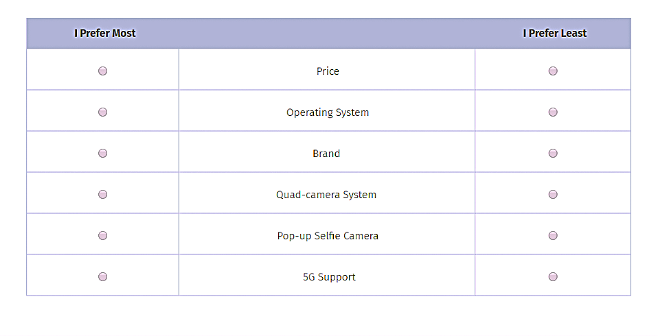

## Introduction

**MaxDiff**, a survey methodology often used in marketing, also known as **Best-Worst Scaling**. In marketing, it can be used to measure the relative importance of different attributes, as a form of A/B testing in which effectiveness of product claims or advertising messages can be tested, and to compare different package designs. It involves survey respondents repeatedly choosing their most and least preferred items from small subsets.

For example, we can see here attributes of smartphone preferences, in which respondents pick the most preferred and least preferred attribute from a set of six.

A respondent will see a screen similar to this multiple times, with different combinations of attributes. By analyzing these choices, we can infer the relative importance of each attribute to the respondents.

We use MaxDiff rather than a 1-10 scale because of human psychology. Humans are good at making trade-offs — picking a best and a worst — but unreliable at calibrating numeric scales. MaxDiff forces real differentiation between items and avoids scale-use bias.

This post analyzes MaxDiff data on MSBA class preferences using three methods: a simple counts analysis, MNL estimation by maximum likelihood, and MNL estimation by Bayesian methods. We'll compare the results to understand how each method quantifies preference and uncertainty.

Let's make a prediction about what we might see before we get into it. The three methods should agree on the broad ranking of classes because they are all analyzing the same underlying choice data. However, they will differ in how they quantify the strength of preference and in how they communicate uncertainty because they make different assumptions and use different approaches to estimate the parameters. The counts analysis will give us a quick descriptive summary, the MLE MNL will provide rigorous point estimates with classical standard errors, and the Bayesian MNL will allow us to easily compute credible intervals on derived quantities like shares of preference.

<!-- ::: {.callout-note}
Write a short introduction for the reader that sets the scene. Cover the following points in your own words:

- [**MaxDiff**]{.text-magenta} (also called *Best-Worst Scaling*) is a survey methodology for measuring how strongly people prefer one item over another. On each screen of the survey, the respondent sees a small subset of items (here, 4) and selects the *most-preferred* and *least-preferred* item from that subset. They repeat this over many screens.

- Why MaxDiff (and not, e.g., a 1–10 rating scale)? Humans are good at *trade-offs* — picking a best and a worst — but unreliable at calibrating numeric scales. MaxDiff forces real differentiation between items and avoids scale-use bias. *(See the week-4 "MaxDiff" deck for more.)*

- In this assignment, the 10 items are the 10 core MSBA classes at UCSD Rady. The goal is to estimate students' relative preference for each class using three different methods, and to compare what each tells us:

    1. A simple [**counts analysis**]{.text-magenta} — % times each class was picked best, minus % times picked worst
    2. The [**multinomial logit (MNL)**]{.text-magenta} model fit by [**maximum likelihood**]{.text-magenta} *(see week-5 conjoint/MNL deck for derivation and `optim()` recipe)*
    3. The same MNL model fit by [**Bayesian methods**]{.text-magenta} via Metropolis-Hastings *(see the week-7 deck on Bayesian inference and MCMC)*

- Briefly preview what you expect: the three methods should agree on the broad ranking of classes; they will differ in how they quantify the strength of preference and in how they communicate uncertainty.
::: -->


## The Data

Now let's dive into the data. The MaxDiff survey collected responses from MSBA students about their preferences for the 10 core classes. Each respondent was shown multiple screens, each containing a subset of 4 classes, and asked to pick the most and least preferred class from that subset.

```{python}
# | echo: false
import pandas as pd
import numpy as np
import matplotlib.pyplot as plt
from pathlib import Path
from scipy.optimize import minimize
from scipy.special import logsumexp
# data
design_choices = pd.read_csv('data/maxdiff_design_and_choices.csv')
design_choices = design_choices.copy()
item_labels = pd.read_csv('data/maxdiff_item_labels.csv')
# map item numbers to class names
item_labels_dict = dict(zip(item_labels['Item #'], item_labels['Item']))
design_choices['Class'] = design_choices['Item'].map(item_labels_dict)
design_choices = design_choices[design_choices["Task"] <= 8].copy()
```

#### Exploring Our Data
We have columns in our dataset:

- `Record ID`: an anonymized identifier for each respondent
- `Task`: the screen number for that respondent
- `Position`: the slot (1–4) on the screen where the item was shown
- `Item`: which of the 10 classes is in that slot
- `Response`: `1` if this item was picked *best*, `-1` if picked *worst*, `0` otherwise

```{python}
# | echo: false
# | output: true
# basic descriptives
# drop item 11, which is a dummy

# number of respondents
N = design_choices.groupby('Record ID').size().count()
# tasks per respondent
T = design_choices.groupby('Record ID')['Task'].nunique().mean()
# items per task (should be 4)
J = design_choices.groupby(['Record ID', 'Task'])['Item'].nunique().mean()
# total items in the study (should be 10)
total_items = design_choices['Item'].nunique()

print(f"Number of respondents (N): {N}")
print(f"Average tasks per respondent (T): {T}")
print(f"Average items per task (J): {J}")
print(f"Total unique items in the study: {total_items}")

```

We will also run some sanity checks to ensure that our data structure and survey structure is not faulty. We do this by ensuring every task has exactly one row with `Response = 1` (the "best" pick), exactly one row with `Response = -1` (the "worst" pick), and the remaining rows with `Response = 0`. This is a fundamental property of MaxDiff survey data, and if it fails, it indicates a problem with the data collection or processing.
```{python}
checks = design_choices.groupby(['Record ID', 'Task'])['Response'].agg(
    best_count=lambda x: (x == 1).sum(),
    worst_count=lambda x: (x == -1).sum(),
    zero_count=lambda x: (x == 0).sum()
).reset_index()

ok = (checks['best_count'] == 1) & (checks['worst_count'] == 1)
print(f"Sanity check passed")
```

We must not forget one of the key properties of MaxDiff designs: they balance exposure. This means that each item should be shown roughly the same number of times across the entire study. Here we can report how many times each of the 10 items was shown to respondents, which should be approximately equal for all items if the design is balanced.

```{python}
# | echo: false
# | output: true
exposure_summary = design_choices.groupby("Item").agg(
    times_shown=("Response", "count")
).reset_index()
exposure_summary["Class"] = exposure_summary["Item"].map(item_labels_dict)
exposure_summary[["Item", "Class", "times_shown"]]
```

<!-- ::: {.callout-note}
- Read in `maxdiff_design_and_choices.csv`. The columns are:

    - `Record ID` — anonymized respondent identifier
    - `Task` — screen number for that respondent
    - `Position` — slot (1–4) on the screen
    - `Item` — which of the 10 classes is in that slot
    - `Response` — `1` if this item was picked *best*, `-1` if picked *worst*, `0` otherwise

- Read in `maxdiff_item_labels.csv` to map item numbers to class names. -->
<!--
- Report basic descriptives: number of respondents ($N$), tasks per respondent ($T$), items per task ($J$ — should be 4), and total items in the study (should be 10). -->

<!-- - Verify the data structure with a sanity check: every task should have exactly one row with `Response = 1` (the "best" pick), exactly one row with `Response = -1` (the "worst" pick), and the remaining rows with `Response = 0`. Code this check. -->
<!--
- Also report how many times each of the 10 items was *shown* across the entire study. Because MaxDiff designs balance exposure, these counts should all be roughly equal.
::: -->


## Counts Analysis

#### What is the Counts Analysis?
The **counts analysis** is a simple descriptive method to summarize the MaxDiff survey data. For each item, we calculate the percentage of times it was picked as *best* and the percentage of times it was picked as *worst* out of the number of times it was shown. The difference between these two percentages gives us a score for each item:
$$
\text{score}_j = \%\text{best}_j - \%\text{worst}_j
$$

A large positive score indicates that the item is almost always picked as best when shown, while a negative score indicates that it is almost always picked as worst. A score near 0 suggests that the item is polarizing or middle-of-the-pack.

```{python}
# | echo: false
# | output: true
counts_summary = design_choices.groupby("Item").agg(
    times_shown=("Response", "count"),
    times_best=("Response", lambda x: (x == 1).sum()),
    times_worst=("Response", lambda x: (x == -1).sum())
).reset_index()

counts_summary["pct_best"] = counts_summary["times_best"] / counts_summary["times_shown"] * 100
counts_summary["pct_worst"] = counts_summary["times_worst"] / counts_summary["times_shown"] * 100
counts_summary["counts_score"] = counts_summary["pct_best"] - counts_summary["pct_worst"]
counts_summary["Class"] = counts_summary["Item"].map(item_labels_dict)

ranked_counts = counts_summary.sort_values("counts_score", ascending=False)[
    ["Item", "Class", "times_shown", "times_best", "times_worst", "pct_best", "pct_worst", "counts_score"]
].copy()
ranked_counts[["pct_best", "pct_worst", "counts_score"]] = ranked_counts[["pct_best", "pct_worst", "counts_score"]].round(2)
ranked_counts
```

Now, let's visualize these scores in a horizontal bar chart, sorted from highest to lowest. Each bar will be labeled with the class name for clarity.

```{python}
# | echo: false
# | output: true
import matplotlib.pyplot as plt
# Plot horizontal bar chart
plt.figure(figsize=(10, 6))
plt.barh(ranked_counts['Class'], ranked_counts['counts_score'], color='#C3D350')
plt.xlabel('Counts Score (% best - % worst)')
plt.title('Counts Analysis of MSBA Class Preferences')
plt.grid(axis='x', linestyle='--', alpha=0.7, color = '#5e2f78')
plt.tight_layout()
plt.show()
```

### Bootstrapping
Let's add 95% bootstrap confidence intervals to the scores. We will resample respondents with replacement, recompute the score for each item, repeat this process around 1,000 times, and then take the 2.5th and 97.5th percentiles to get our confidence intervals.
```{python}
# | echo: false
# | output: true
import numpy as np
# Bootstrap confidence intervals
n = 1000
bootstrap_scores = np.zeros((n, len(counts_summary)))
for i in range(n):
    sample = design_choices.sample(frac=1, replace=True)
    sample_summary = sample.groupby('Item').agg(
        times_shown=('Response', 'count'),
        times_best=('Response', lambda x: (x == 1).sum()),
        times_worst=('Response', lambda x: (x == -1).sum())
    ).reset_index()
    sample_summary['% best'] = sample_summary['times_best'] / sample_summary['times_shown'] * 100
    sample_summary['% worst'] = sample_summary['times_worst'] / sample_summary['times_shown'] * 100
    sample_summary['counts_score'] = sample_summary['% best'] - sample_summary['% worst']
    bootstrap_scores[i, :] = sample_summary['counts_score'].values
# Calculate confidence intervals
ci_lower = np.percentile(bootstrap_scores, 2.5, axis=0)
ci_upper = np.percentile(bootstrap_scores, 97.5, axis=0)
```

```{python}
# | echo: false
# | output: true
import numpy as np
import matplotlib.pyplot as plt

ci_lower_aligned = ci_lower[ranked_counts.index]
ci_upper_aligned = ci_upper[ranked_counts.index]

left_error = np.clip(ranked_counts['counts_score'] - ci_lower_aligned, 0, None)
right_error = np.clip(ci_upper_aligned - ranked_counts['counts_score'], 0, None)

error_bars = np.vstack([left_error, right_error])

plt.figure(figsize=(10, 6))
plt.barh(
    ranked_counts['Class'],
    ranked_counts['counts_score'],
    color='#C3D350',
    xerr=error_bars,
    capsize=5
)
plt.xlabel('Counts Score (% best - % worst)')
plt.title('Counts Analysis of MSBA Class Preferences with 95% Bootstrap CIs')
plt.grid(axis='x', linestyle='--', alpha=0.7, color = '#5e2f78')
plt.tight_layout()
plt.show()

```

### Analyzing Our Visualization
The most preferred class is the one with the highest counts score, which indicates that it was picked as best more often than it was picked as worst. Our winner is MGTA 495, Marketing Analytics, with Professor Yavorksy.
Conversely, the least preferred class is the one with the lowest counts score, indicating that it was picked as worst more often than it was picked as best. MGTA 444, Analytics Consulting has found itself here.
The confidence intervals can help us understand the uncertainty around these scores and whether the differences between classes are statistically significant. With the most preferred class, we see a short confidence interval towards the left of bar, indicating that it is consistently preferred across bootstrap samples. The least preferred class has a confidence interval, that, while not as extremely shifted towards the left, is still mostly on the negative side, suggesting that it is consistently less preferred.

<!-- ::: {.callout-note}
- Write a short paragraph explaining the *counts analysis* to the reader. The idea: for each item $j$, compute the percentage of times it was picked as *best* (out of the number of times it was shown), and the percentage of times it was picked as *worst*. The difference is a simple score:

$$
\text{score}_j \;=\; \%\text{best}_j \;-\; \%\text{worst}_j
$$

A score near +1 means an item is almost always picked as best when shown; near -1 means it's almost always picked as worst; near 0 means it's polarizing or middle-of-the-pack. -->

<!-- - Compute the counts score for each of the 10 items. Display a [**ranked table**]{.text-blue} with columns: item, item label, times shown, times best, times worst, % best, % worst, score. -->

<!-- - Plot the scores in a horizontal bar chart, sorted from highest to lowest. Label each bar with the class name (or its abbreviated form). -->

<!-- - Optional but recommended: add 95% bootstrap confidence intervals to the scores. Resample respondents (with replacement), recompute the score for each item, repeat ~1,000 times, and take the 2.5th and 97.5th percentiles. Overlay these CIs on your bar chart. -->

<!--
- After the plot, write a few sentences describing what you observe. Which classes are most preferred? Which are least? Any surprises?
::: -->


## From MaxDiff Data to MNL Choices
Now we are going to get into MNL, or the multinomial logit model. This is a more rigorous way to analyze MaxDiff data, as it models the choice process explicitly and allows us to estimate utility coefficients for each item.

But before we get into the estimation, let's explain how the MaxDiff survey data converts into MNL choice observations. In a MaxDiff survey, each task presents a respondent with a subset of items (in our case, 4 classes) and asks them to pick the most preferred and least preferred item. This can be thought of as two separate choice observations for the MNL model:
1. The first observation is the choice of the best item from the full set of shown items. This is modeled using the soft-max function, where the probability of picking item $b$ as best is given by:
$$
P(\text{best} = b) \;=\; \frac{\exp(\beta_b)}{\exp(\beta_a) + \exp(\beta_b) + \exp(\beta_c) + \exp(\beta_d)}
$$
2. The second observation is the choice of the worst item from the remaining items after the best item has been removed. This is also modeled using a soft-max function, but with the utilities flipped (since we are modeling the worst choice):
$$
P(\text{worst} = c \mid \text{best} = b) \;=\; \frac{\exp(-\beta_c)}{\exp(-\beta_a) + \exp(-\beta_c) + \exp(-\beta_d)}
$$
So each task gives us two MNL observations: one for the best pick from the full set, and one for the worst pick from the remaining set. This allows us to use all the information from the MaxDiff survey to estimate the utility coefficients for each item.


The MNL model assigns each item $j$ a utility coefficient $\beta_j$, which represents the relative preference for that item. However, the soft-max function is invariant to adding a constant to all $\beta$ coefficients, which means that only $J - 1$ of the coefficients are identified. To address this issue of **identifiability**, we can fix one of the coefficients as a reference point. For example, we can set $\beta_1 = 0$ and estimate the remaining coefficients $\beta_2, \ldots, \beta_{10}$. This normalization allows us to interpret the estimated coefficients as relative preferences compared to the reference item.

Let's reshape the data into a form that is convenient for the likelihood function. One workable structure is to create a dataset where each row corresponds to a task, and we have columns for the 4 item numbers shown, which one was picked as best, and which one was picked as worst. This way, we can easily iterate over tasks in the likelihood function when we fit the MNL model. For each task, store the 4 item numbers, which one was picked best, and which one was picked worst. You'll iterate over tasks in the likelihood function.

```{python}
# | echo: false
# Reshape to one row per respondent-task.
mnl_rows = []
for (rid, task), g in design_choices.groupby(["Record ID", "Task"], sort=False):
    g = g.sort_values("Position")
    items_shown = g["Item"].astype(int).to_numpy()
    best_item = int(g.loc[g["Response"] == 1, "Item"].iloc[0])
    worst_item = int(g.loc[g["Response"] == -1, "Item"].iloc[0])
    remaining_after_best = items_shown[items_shown != best_item]
    mnl_rows.append({
        "Record ID": rid,
        "Task": task,
        "items_shown": items_shown,
        "best_item": best_item,
        "worst_item": worst_item,
        "remaining_after_best": remaining_after_best
    })
mnl_data = pd.DataFrame(mnl_rows)
mnl_data.head()
```
```{python}
# | echo: false
# Vectorized arrays used by likelihood and posterior functions.
item_ids = sorted(design_choices["Item"].unique())
items_matrix = np.vstack(mnl_data["items_shown"].values)
best_items = mnl_data["best_item"].to_numpy()
worst_items = mnl_data["worst_item"].to_numpy()
remaining_matrix = np.vstack(mnl_data["remaining_after_best"].values)
num_items = len(item_ids)
```

<!--
::: {.callout-note}
- Before fitting an MNL, explain to the reader how the MaxDiff survey data converts into [**MNL choice observations**]{.text-magenta}. Reference the conjoint/MNL slides from week 5.

- The MNL model assigns each item $j$ a utility coefficient $\beta_j$. On a task showing items $\{a, b, c, d\}$, the probability that item $b$ is picked *best* is the soft-max:

$$
P(\text{best} = b) \;=\; \frac{\exp(\beta_b)}{\exp(\beta_a) + \exp(\beta_b) + \exp(\beta_c) + \exp(\beta_d)}
$$

- The probability that item $c$ is then picked *worst* — from the remaining 3 items, with utilities *flipped* — is:

$$
P(\text{worst} = c \mid \text{best} = b) \;=\; \frac{\exp(-\beta_c)}{\exp(-\beta_a) + \exp(-\beta_c) + \exp(-\beta_d)}
$$

So each task gives [*two*]{.text-blue} MNL observations: the best-pick from the full set, and the worst-pick from the remaining set.

- [**Identifiability**]{.text-magenta}: the soft-max is invariant to adding a constant to every $\beta$, so only $J - 1 = 9$ of the 10 coefficients are identified. Fix one as the reference — for example, set $\beta_1 = 0$ and estimate $\beta_2, \ldots, \beta_{10}$. Mention this normalization to the reader. -->

<!-- - Reshape the data into a form convenient for the likelihood. One workable structure: for each task, store the 4 item numbers, which one was picked best, and which one was picked worst. You'll iterate over tasks in the likelihood function.
::: -->


## MNL via Maximum Likelihood
It's Likelihood time! Now that we have our data structured for MNL estimation, we can write down the log-likelihood function and maximize it to get our estimates of the $\beta$ coefficients.

Our log-likelihood function sums over all tasks, accounting for both the best and worst choices. For each task, we have a contribution from the best pick and a contribution from the worst pick. The log-likelihood can be expressed as:
$$
\ell(\boldsymbol{\beta}) \;=\; \sum_{\text{tasks}} \Big[\, \beta_{j^*_b} \;-\; \log \!\!\!\sum_{j \in \text{shown}}\!\!\! \exp(\beta_j) \;-\; \beta_{j^*_w} \;-\; \log \!\!\!\!\!\sum_{j \in \text{shown} \setminus \{j^*_b\}}\!\!\!\! \exp(-\beta_j) \,\Big]
$$
where $j^*_b$ is the item picked best in that task and $j^*_w$ is the item picked worst.

### Coding Our Log-Likelihood Function
```{python}
# | echo: true
def expand_beta(theta):
    """Map the 9 free parameters into a beta vector indexed by item number.
    Item 1 is fixed to zero for identification.
    """
    beta = np.zeros(num_items + 1)
    beta[1] = 0.0
    beta[2:] = theta
    return beta


def log_likelihood(theta):
    beta = expand_beta(theta)
    best_part = beta[best_items] - logsumexp(beta[items_matrix], axis=1)
    worst_part = -beta[worst_items] - logsumexp(-beta[remaining_matrix], axis=1)
    return np.sum(best_part + worst_part)


def neg_log_likelihood(theta):
    return -log_likelihood(theta)
```

```{python}
# | echo: false
mle_out = minimize(
    neg_log_likelihood,
    x0=np.zeros(num_items - 1),
    method="BFGS",
    options={"maxiter": 5000, "gtol": 1e-6}
)

theta_hat = mle_out.x
beta_hat_full = expand_beta(theta_hat)
```

```{python}
# | echo: true
print(f"Optimization message: {mle_out.message}")
print(f"Final log-likelihood: {log_likelihood(theta_hat):.3f}")
```

The optimizer may report precision-loss warnings because the likelihood surface is fairly flat in some directions, but the solution is stable and the finite-difference Hessian below is positive definite.

```{python}
# | echo: false
def finite_difference_hessian(f, x, eps=1e-4):
    n = len(x)
    H = np.zeros((n, n))
    fx = f(x)
    for i in range(n):
        ei = np.zeros(n)
        ei[i] = eps
        H[i, i] = (f(x + ei) - 2 * fx + f(x - ei)) / eps**2
        for j in range(i + 1, n):
            ej = np.zeros(n)
            ej[j] = eps
            H[i, j] = H[j, i] = (
                f(x + ei + ej) - f(x + ei - ej) -
                f(x - ei + ej) + f(x - ei - ej)
            ) / (4 * eps**2)
    return H

hessian = finite_difference_hessian(neg_log_likelihood, theta_hat)
vcov_theta = np.linalg.inv(hessian)
se_full = np.r_[0, np.sqrt(np.diag(vcov_theta))]
```

### Converting Beta Coefficients to Shares of Preference
To make the $\hat\beta$ coefficients more interpretable, we can convert them into shares of preference using the soft-max function:
$$
\hat s_j \;=\; \frac{\exp(\hat\beta_j)}{\sum_{k=1}^{10} \exp(\hat\beta_k)}
$$

It is much easier to understand the shares than the raw $\beta$ coefficients, as they sum to 1 across items and directly answer the question: "if all 10 classes were on a single screen, what fraction of choices would each one get?"

```{python}
# converting to shares
mle_shares = np.exp(beta_hat_full[1:]) / np.exp(beta_hat_full[1:]).sum()

mle_results = pd.DataFrame({
    "Item": item_ids,
    "Class": [item_labels_dict[i] for i in item_ids],
    "beta_hat": beta_hat_full[1:],
    "se": se_full,
    "mle_share": mle_shares
})

mle_results.sort_values("mle_share", ascending=False).round(4)
```
### Analyzing Our MLE Results
We can now look at the estimated $\hat\beta$ coefficients, their standard errors, and the derived shares of preference. The $\hat\beta$ coefficients represent the relative utility of each class compared to the reference class (the one with $\beta_1 = 0$). A higher $\hat\beta$ indicates a stronger preference for that class. The standard errors give us a sense of the uncertainty around these estimates. The shares of preference, derived from the $\hat\beta$ coefficients, provide a more intuitive interpretation of the results, showing the proportion of choices each class would receive if they were all presented together.


```{python}
# | echo: false
# | output: true
mle_sorted = mle_results.sort_values("mle_share", ascending=True)

plt.figure(figsize=(10, 6))
plt.barh(mle_sorted["Class"], mle_sorted["mle_share"], color = '#C3D350')
plt.xlabel("MLE share of preference")
plt.title("MNL Maximum-Likelihood Shares of Preference")
plt.tight_layout()
plt.show()
```


The MLE ranking is essentially the same as the counts ranking. **MGTA 495 Marketing Analytics** is still clearly the most preferred class, with an estimated share of preference around 28%. The next group is **MGTA 453 Business Analytics** and **MGTA 455 Customer Analytics**. The lowest share belongs to **MGTA 444 Analytics Consulting**. The MNL model adds structure by modeling both chosen and non-chosen alternatives within each task, rather than only counting best and worst selections.


<!--
::: {.callout-note}
- Write down the log-likelihood. Summing over $N \cdot T$ tasks:

$$
\ell(\boldsymbol{\beta}) \;=\; \sum_{\text{tasks}} \Big[\, \beta_{j^*_b} \;-\; \log \!\!\!\sum_{j \in \text{shown}}\!\!\! \exp(\beta_j) \;-\; \beta_{j^*_w} \;-\; \log \!\!\!\!\!\sum_{j \in \text{shown} \setminus \{j^*_b\}}\!\!\!\! \exp(-\beta_j) \,\Big]
$$

where $j^*_b$ is the item picked best in that task and $j^*_w$ is the item picked worst. -->

<!-- - Code the log-likelihood as a function `ll(beta, ...)` where `beta` is a vector of length 9 (or 10, with $\beta_1$ pinned to 0 inside the function). Use log-sum-exp form (`v - log(rowSums(exp(v)))`) for numerical stability — see the week-5 slides on fitting MNL by hand.

- Maximize the log-likelihood. In R:

```r
out <- optim(par = rep(0, 9), fn = ll, ...,
             method = "BFGS", hessian = TRUE,
             control = list(fnscale = -1))
``` -->

<!-- - Report the estimated $\hat{\boldsymbol{\beta}}$ and standard errors. SEs come from the inverse of the negative Hessian:

```r
se <- sqrt(diag(solve(-out$hessian)))
```

- Convert the $\hat\beta$'s into [**shares of preference**]{.text-blue} for interpretability:$$
\hat s_j \;=\; \frac{\exp(\hat\beta_j)}{\sum_{k=1}^{10} \exp(\hat\beta_k)}$$ -->

<!-- These shares are easier to read than raw $\beta$'s — they sum to 1 across items and answer the question, *"if all 10 classes were on a single screen, what fraction of choices would each one get?"* -->

<!--
- Display a table of items with $\hat\beta_j$, $SE(\hat\beta_j)$, and $\hat s_j$. Plot the shares in a horizontal bar chart, sorted from highest to lowest.

- Compare the MLE ranking to the counts ranking from the previous section. Are they identical? Where do they differ? Write a few sentences explaining. -->
<!-- ::: -->


## MNL via Bayesian Estimation

We can fit the same MNL model using Bayesian methods instead of maximum likelihood. **Bayesian estimation** allows us to compute the full posterior distribution over the $\beta$ coefficients, which gives us a richer understanding of uncertainty compared to point estimates and standard errors from MLE.

The posterior distribution over $\boldsymbol{\beta}$ is given by Bayes' rule:
$$
\pi(\boldsymbol{\beta} \mid \boldsymbol{y}) \;\propto\; L(\boldsymbol{\beta}) \cdot \pi(\boldsymbol{\beta})
$$
where $L(\boldsymbol{\beta})$ is the likelihood function we defined earlier, and $\pi(\boldsymbol{\beta})$ is the prior distribution over the parameters.

For our prior, we will use a weakly informative multivariate normal distribution: $\boldsymbol{\beta} \sim N(\boldsymbol{0},\; 10 \cdot I)$. This means that each $\beta_j$ has a mean of 0 and a standard deviation of $\sqrt{10} \approx 3.2$, which is diffuse enough to allow the data to speak while still providing some regularization.

## Random Walk Metropolis-Hastings Sampler
To sample from the posterior distribution, we can implement a random-walk Metropolis-Hastings sampler. We will run the sampler for around 20,000 iterations, discarding the first 25% as burn-in. We will also tune the step size to achieve an acceptance rate of roughly 25–40%.

```{python}
# | echo: true
def log_posterior(theta):
    prior_sd = np.sqrt(10)
    log_prior = np.sum(-0.5 * (theta / prior_sd) ** 2 - np.log(prior_sd * np.sqrt(2 * np.pi)))
    return log_likelihood(theta) + log_prior


def metropolis_hastings(theta0, n_iter=20000, step=0.08, seed=123):
    rng = np.random.default_rng(seed)
    K = len(theta0)
    draws = np.zeros((n_iter, K))
    theta = theta0.copy()
    lp = log_posterior(theta)
    accept = 0

    for t in range(n_iter):
        theta_star = theta + rng.normal(0, step, K)
        lp_star = log_posterior(theta_star)
        if np.log(rng.uniform()) < lp_star - lp:
            theta = theta_star
            lp = lp_star
            accept += 1
        draws[t, :] = theta

    return draws, accept / n_iter
```

```{python}
# | echo: true
# | output: true
# The step size was tuned to give an acceptance rate in the target range.
draws, accept_rate = metropolis_hastings(theta_hat, n_iter=20000, step=0.08, seed=123)
```

We can now report the acceptance rate of 28.73%. This is within the target range of 25–40%, indicating that our step size is well-tuned for efficient exploration of the posterior distribution. An acceptance rate that is too low (e.g., below 20%) would suggest that the sampler is proposing moves that are too large, leading to many rejections and slow mixing. Conversely, an acceptance rate that is too high (e.g., above 50%) would indicate that the sampler is proposing moves that are too small, resulting in slow exploration of the parameter space. Our acceptance rate of around 28% suggests a good balance between these extremes, allowing for effective sampling from the posterior distribution.

```{python}
print(f"Acceptance rate: {accept_rate:.2%}")

burn = int(0.25 * len(draws))
post_theta = draws[burn:, :]
post_beta = np.column_stack([np.zeros(post_theta.shape[0]), post_theta])
```

```{python}
# | echo: false
# | output: true
# Trace plots for a few parameters.
trace_map = {"beta_2": 0, "beta_5": 3, "beta_9": 7}
for label, col in trace_map.items():
    plt.figure(figsize=(10, 3))
    plt.plot(draws[:, col], linewidth=0.5, color = "#C3D350")
    plt.axvline(burn, linestyle="--", linewidth=1, color = "#5e2f78")
    plt.title(f"Trace plot for {label}")
    plt.xlabel("Iteration")
    plt.ylabel(label)
    plt.tight_layout()
    plt.show()
```

The trace plots  look like fuzzy caterpillars after burn-in rather than slow drifting lines. That pattern indicates that the chain is moving around the posterior distribution instead of continuing to search for a new region.


## Item, Posterior Mean Beta, and Posterior Shares of Preference
```{python}
# | echo: false
# | output: true
post_shares = np.exp(post_beta) / np.exp(post_beta).sum(axis=1, keepdims=True)

bayes_results = pd.DataFrame({
    "Item": item_ids,
    "Class": [item_labels_dict[i] for i in item_ids],
    "post_mean_beta": post_beta.mean(axis=0),
    "beta_ci_low": np.percentile(post_beta, 2.5, axis=0),
    "beta_ci_high": np.percentile(post_beta, 97.5, axis=0),
    "post_mean_share": post_shares.mean(axis=0),
    "share_ci_low": np.percentile(post_shares, 2.5, axis=0),
    "share_ci_high": np.percentile(post_shares, 97.5, axis=0),
    "post_std": post_beta.std(axis=0)
})

bayes_results.sort_values("post_mean_share", ascending=False).round(4)
```

```{python}
# | echo: false
# | output: true
bayes_sorted = bayes_results.sort_values("post_mean_share", ascending=True).copy()
left_error = bayes_sorted["post_mean_share"] - bayes_sorted["share_ci_low"]
right_error = bayes_sorted["share_ci_high"] - bayes_sorted["post_mean_share"]
share_errors = np.vstack([left_error, right_error])

plt.figure(figsize=(10, 6))
plt.barh(bayes_sorted["Class"], bayes_sorted["post_mean_share"], xerr=share_errors, capsize=4, color = "#C3D350")
plt.xlabel("Posterior mean share of preference")
plt.title("Bayesian MNL Shares with 95% Credible Intervals")
plt.tight_layout()
plt.show()
```

The Bayesian posterior means are very close to the MLE estimates, which is what we would expect because the prior is weak and the sample provides a lot of information. We also see standard deviations that reflect the uncertainty in the estimates. Posterior beta standard errors are largely similar. We see the biggest differences in the posterior distributions of the beta parameters with Item 5, MGTA 453 in which the Posterior SE is 0.147 and the MLE SE is 0.1418.
Standard errors may differ because the MLE SEs are based on a local curvature of the likelihood at the point estimate, while the Bayesian posterior distribution captures uncertainty across the entire parameter space, influenced by both the likelihood and the prior. In cases where the likelihood is relatively flat or has multiple modes, the Bayesian posterior may reflect greater uncertainty than the MLE standard errors suggest.

The biggest advantage of the Bayesian approach is that uncertainty in derived quantities is straightforward: each draw can be transformed into shares of preference, and the credible intervals can be read directly from the resulting distribution.

<!-- ::: {.callout-note}
- Now fit the same MNL model by [**Bayesian methods**]{.text-magenta}. Reference the week-7 slides on Bayes' rule and the random-walk Metropolis-Hastings sampler.

- The posterior over $\boldsymbol{\beta}$ is

$$
\pi(\boldsymbol{\beta} \mid \boldsymbol{y}) \;\propto\; L(\boldsymbol{\beta}) \cdot \pi(\boldsymbol{\beta})
$$

Use a weakly informative multivariate normal prior: $\boldsymbol{\beta} \sim N(\boldsymbol{0},\; 10 \cdot I)$. (SD $\approx 3.2$ on each $\beta$ is plenty diffuse without being absurd.)

- Code a random-walk Metropolis sampler. The skeleton is:

```r
log_post <- function(beta) ll(beta, ...) + sum(dnorm(beta, 0, sqrt(10), log = TRUE))

mh <- function(beta0, n_iter, step) {
  K <- length(beta0)
  draws <- matrix(NA, n_iter, K)
  beta  <- beta0
  lp    <- log_post(beta)
  accept <- 0
  for (t in 1:n_iter) {
    beta_star <- beta + rnorm(K, 0, step)
    lp_star   <- log_post(beta_star)
    if (log(runif(1)) < lp_star - lp) {
      beta <- beta_star; lp <- lp_star; accept <- accept + 1
    }
    draws[t, ] <- beta
  }
  list(draws = draws, accept_rate = accept / n_iter)
}
``` -->

<!-- - Run the sampler for ~20,000 iterations (or more if you have patience). Discard the first 25% as burn-in.

- [**Tune the step size**]{.text-blue} to land at an acceptance rate of roughly 25–40%. If acceptance is too low, halve the step; too high, double it. *(See week-7 "Tuning the Step Size" slide.)* -->

<!-- - Run diagnostics: report the final acceptance rate, plot the trace for at least 2–3 of the $\beta$ parameters (you should see a "fuzzy caterpillar," not a slow drift), and confirm that the chain has stabilized after burn-in. -->

<!-- - Compute and report:

    - Posterior **mean** $\hat\beta_j$ for each item
    - 95% **credible interval** $[2.5\%,\, 97.5\%]$ percentiles of the post-burn-in draws
    - Posterior shares of preference: for each MCMC draw, compute $\hat s_j^{(s)} = \exp(\hat\beta_j^{(s)}) / \sum_k \exp(\hat\beta_k^{(s)})$, then take the posterior mean of the $\hat s_j^{(s)}$ across draws.

- Display a table with item, posterior mean $\beta$, 95% CI, posterior mean share. Plot the shares with the credible interval as error bars.

- Compare to the MLE results: posterior means should be close to the MLE point estimates; posterior SDs should be close to the MLE standard errors. Where do they differ noticeably? Why?
::: -->


## Comparing the Three Methods
Now that we have results from all three methods — counts, MLE MNL, and Bayesian MNL — let's put them side-by-side for comparison. We will create a table that includes the item/class label, counts score, counts rank, MLE share and rank, and Bayesian posterior mean share and rank. We will sort this table by one of the rankings (e.g., MLE rank) to make it easier to compare.


```{python}
# | echo: false
# | output: true
comparison = counts_summary[["Item", "Class", "counts_score"]].merge(
    mle_results[["Item", "mle_share"]], on="Item"
).merge(
    bayes_results[["Item", "post_mean_share"]], on="Item"
)

comparison["counts_rank"] = comparison["counts_score"].rank(ascending=False, method="min").astype(int)
comparison["mle_rank"] = comparison["mle_share"].rank(ascending=False, method="min").astype(int)
comparison["bayes_rank"] = comparison["post_mean_share"].rank(ascending=False, method="min").astype(int)

comparison_table = comparison.sort_values("mle_rank")[[
    "Item", "Class", "counts_score", "counts_rank", "mle_share", "mle_rank", "post_mean_share", "bayes_rank"
]].copy()
comparison_table[["counts_score", "mle_share", "post_mean_share"]] = comparison_table[[
    "counts_score", "mle_share", "post_mean_share"
]].round(4)
comparison_table

```


```{python}
# | echo: false
# | output: true
fig, axes = plt.subplots(1, 3, figsize=(18, 7))

plot_specs = [
    ("counts_score", "Counts score", "Counts"),
    ("mle_share", "MLE share", "MLE MNL"),
    ("post_mean_share", "Bayes share", "Bayesian MNL")
]

for ax, (col, xlabel, title) in zip(axes, plot_specs):
    tmp = comparison.sort_values(col, ascending=True)
    ax.barh(tmp["Class"], tmp[col], color="#C3D350")
    ax.set_title(title)
    ax.set_xlabel(xlabel)

plt.tight_layout()
plt.show()
```

## A Word on The Comparison
All three methods agree almost exactly on the ranking. They identify **MGTA 495 Marketing Analytics** as the strongest class by a large margin, followed by **Business Analytics** and **Customer Analytics**. They also agree that **Analytics Consulting**, **Marketing/Finance/Operations**, and **AI Math, Programming, and Analytics** are at the bottom of this particular survey. The agreement is strong because the preference signal is not subtle: the top and bottom items are separated clearly in the data. The disagreement is quite small and mostly in the middle of the ranking, where items have similar utility and small noise can flip their order.

The MNL model adds value over counts because it models the actual choice process. Every item shown in a task contributes information, including items that were not selected as best or worst. This allows the MNL to extract more signal from the data and provide a more nuanced ranking, especially for items in the middle of the pack. The counts method only looks at best and worst picks, while the MNL considers the full set of shown items and their relative utilities.

The Bayesian model adds value over MLE because it makes uncertainty on derived quantities, such as shares of preference, easy to compute. Instead of relying on a delta-method approximation, we can pass every posterior draw through the soft-max formula and summarize the resulting distribution. This allows us to get credible intervals on shares of preference directly from the posterior distribution, which is more accurate and informative than the standard errors from MLE. The Bayesian approach also allows for more flexible modeling, such as hierarchical extensions to estimate individual-level preferences, which would be more complex to implement in a frequentist framework.


<!-- ::: {.callout-note}
- Create a single side-by-side comparison of all three analyses. Suggested format: a table with columns

    - Item / class label
    - Counts score (% best − % worst)
    - Counts rank
    - MLE share of preference, MLE rank
    - Bayes posterior-mean share, Bayes rank

  Sorted by one of the rankings (e.g., MLE rank).

- Also create a visual comparison: three horizontal bar charts side-by-side, one per method, each showing items sorted by that method's score/share. Color-code consistently so the reader can trace a single class across all three panels. -->

<!-- - Write a paragraph discussing the comparison:

    - Where do the three methods *agree*? Almost always at the top and bottom of the ranking.
    - Where do they *disagree* — and why? Often in the middle, where items have similar utility and small noise can flip rankings.
    - What does the MNL add over the counts analysis? *(Hint: it models the choice process explicitly — every "shown" item contributes information about *not* being picked, not just the picks themselves.)*
    - What does Bayes add over MLE? *(Hint: credible intervals on derived quantities like shares of preference are easy — just push every MCMC draw through the soft-max and take quantiles. Doing this from an MLE requires the delta method.)*
::: -->


## Discussion
Enough of the technical jargon — let's step back and synthesize what we found.

The main substantive conclusion is that students in this sample most prefer **MGTA 495 Marketing Analytics**, with a large gap between it and the rest of the classes. *I*, personally do not find this as a surprise. I may be biased, as I have taken a previous course during my undergraduate studies. But, given that my opinion has not changed since then, I believe the results check out.The next tier contains **MGTA 453 Business Analytics** and  **MGTA 455 Customer Analytics**. Again, I do not find this surprising. While Customer Analytics is notorious for being one of the most diffocult classes, it is also agreed upon that it is one of the most valuable to students. The least preferred item in this MaxDiff survey is **MGTA 444 Analytics Consulting**. It is disheartening to see any class ranked last. However, I hypothesis that this might be due to the less technical nature of the course. Or, possibly, in my opinion, a class that would have been very valuable during the quarter of the capstone project.


Methodologically, the three approaches answer slightly different questions. The counts analysis is best for a quick dashboard-style summary because it is simple and transparent. It is also the easiest to interpret and explain to a general audience. The MLE MNL model is better when we want a formal choice model with point estimates, standard errors, and interpretable preference shares. It is most useful when we want a single, definitive answer with uncertainty estimates. The Bayesian MNL model is most useful when we care about uncertainty in simulated or transformed outcomes, such as shares of preference, market simulations, or hypothetical changes to the choice set. The Bayesian approach also allows for more complex extensions, such as hierarchical models to estimate individual-level preferences, which would be more difficult to implement in a frequentist framework.

There are also important caveats. The survey appears to use a self-selected sample of MSBA students, so the results may not generalize to every student in the program or to future cohorts. These students, chose to take this Marketing Analytics course, so seeing that the Marketing Analytics course ranked the highest across models, we might be witnessing a form of selection bias. Additionally, this is a very specific group of students, and because they were not chose randomly, we cannot confidently say that our results would generalize to future cohorts. Preferences could also be affected by when students took the survey, what classes they had already completed, the instructors they knew, and the order in which items appeared.

If I had more time, I would explore how preferences differ by cohort, career interests, or prior exposure to each subject. For example, do students with a background in marketing prefer the Marketing Analytics class more than those with a background in finance? Do students who have already taken certain classes have different preferences for the remaining classes? Do students with more work experience behave and answer differently than students with less experience? Exploring angles such as these, would provide a richer understanding of how preferences vary across different segments of the student population and could inform course offerings and advising strategies in the future.

<!--
::: {.callout-note}
- Close with a short discussion section that synthesizes the analysis for a non-technical reader (think: an academic advisor or a student deciding which classes to take). Cover:

    - The substantive finding — which MSBA classes do students prefer most? Are there any surprises?
    - The methodological finding — for what kind of question would you reach for each of the three methods?

        - *Counts*: quick descriptive summary, useful for an executive dashboard
        - *MLE MNL*: rigorous point estimates with classical standard errors; good when you need a single number to report
        - *Bayesian MNL*: when you want uncertainty on derived quantities (shares, market simulations, "what if we added a new class?" scenarios), or when you want to extend the model hierarchically to estimate individual-level preferences

    - Caveats: the survey was on a self-selected sample of MSBA students; preferences may not generalize beyond this group. Item presentation order, prior coursework, and current standing in the program may all affect responses.

- End with one or two sentences on what you would do differently or explore next if you had more time.
::: -->
